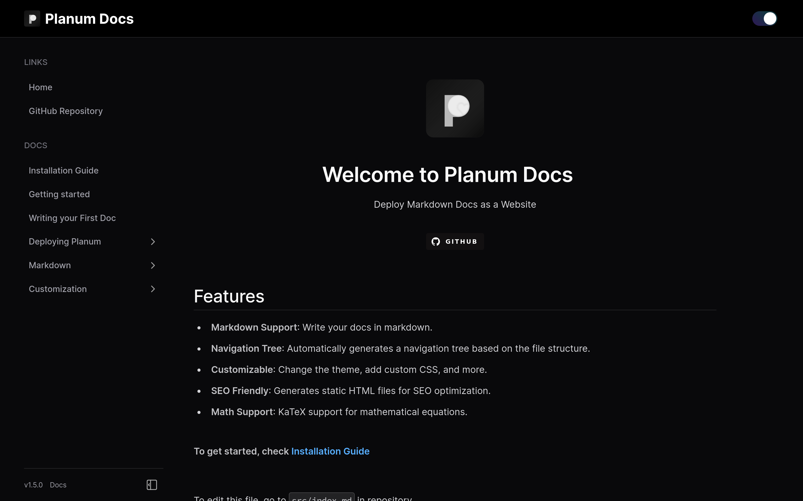
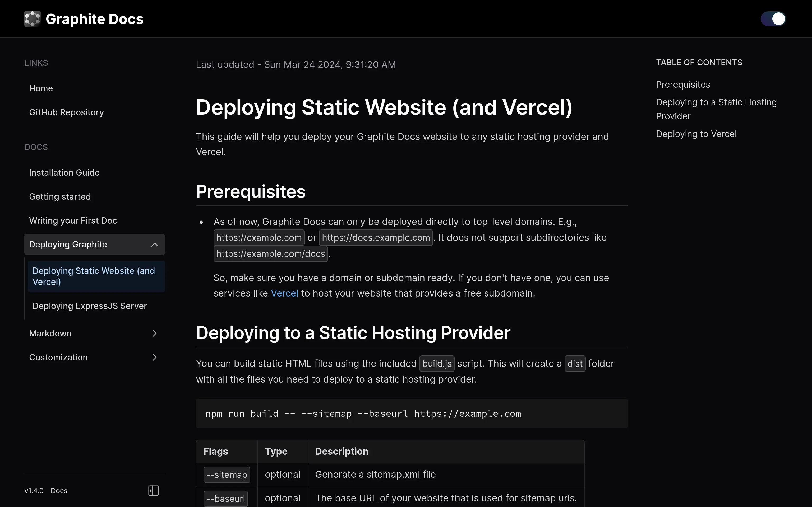

# Planum Docs: Markdown to HTML Documentation Websites

## Introduction

Planum, named after [Sputnik Planum](https://www.nasa.gov/image-article/intricate-surface-patterns-revealed-plutos-sputnik-planum/), is a simple server that serves markdown files as HTML. It uses the `express` framework and `EJS` as the view engine. Generates static HTML files from markdown to serve them as a website.

## Features

- **Markdown Support**: Write your docs in markdown.
- **Math Support**: KaTeX support for mathematical equations.
- **Navigation Tree**: Automatically generates a navigation tree based on your document file structure.
- **Customizable**: Change the theme, add custom CSS, and more.
- **SEO Friendly**: Generates static HTML files for SEO optimization.
- **Print Docs**: Clean print-friendly pages for easy printing.

## Documentation

Check out the [documentation](https://planum-docs.vercel.app) to learn how to install and start using Planum.

## License

This project is licensed under the MIT License - see the [LICENSE.md](LICENSE.md) file for details.
